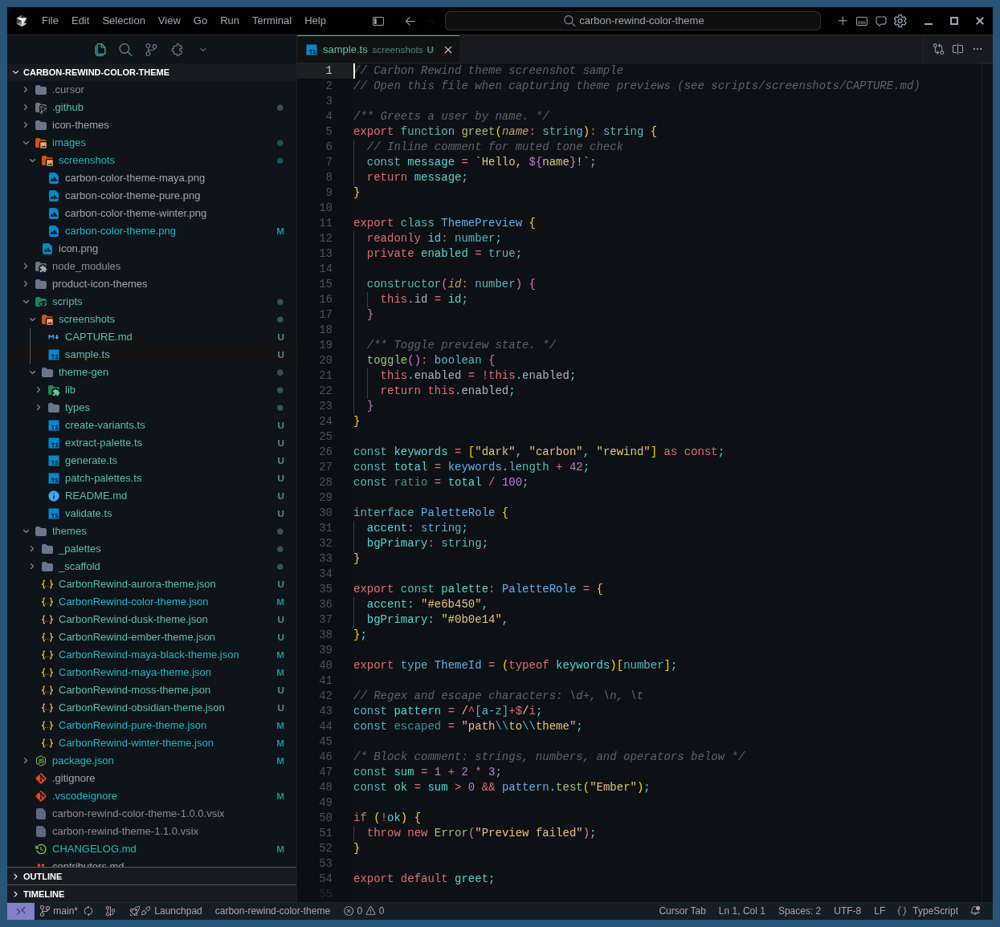
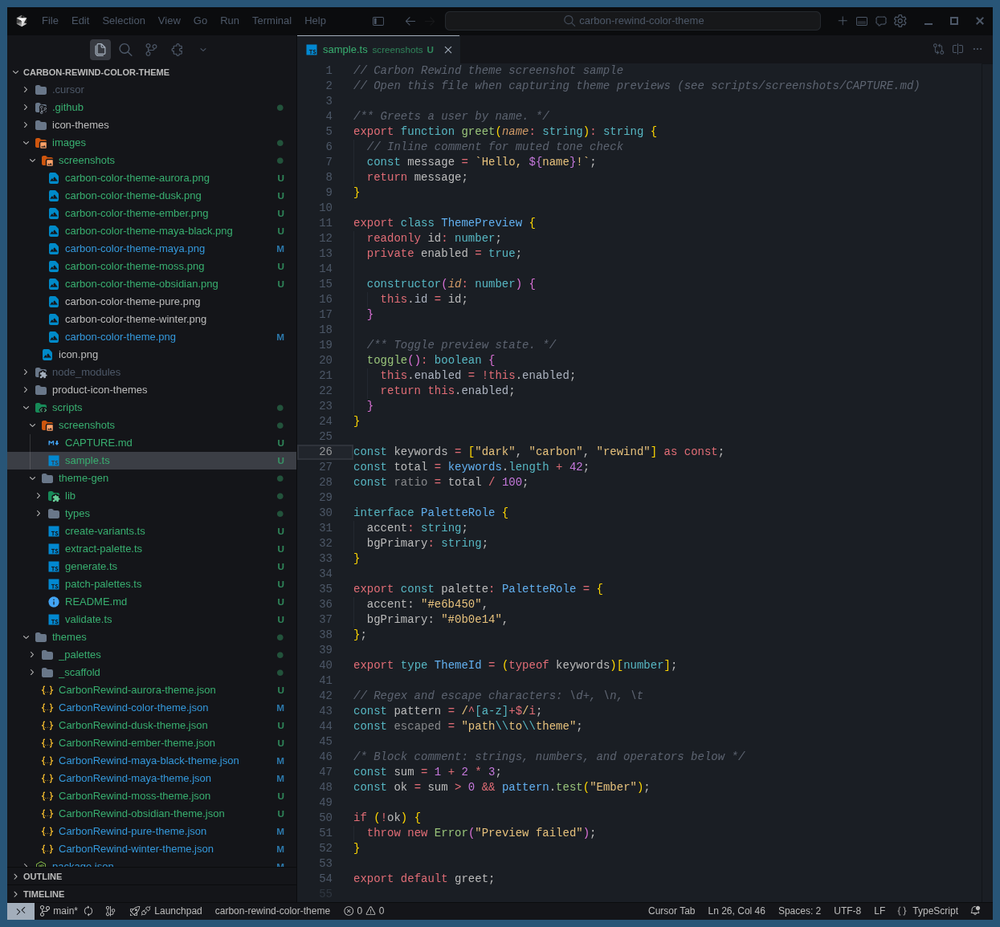
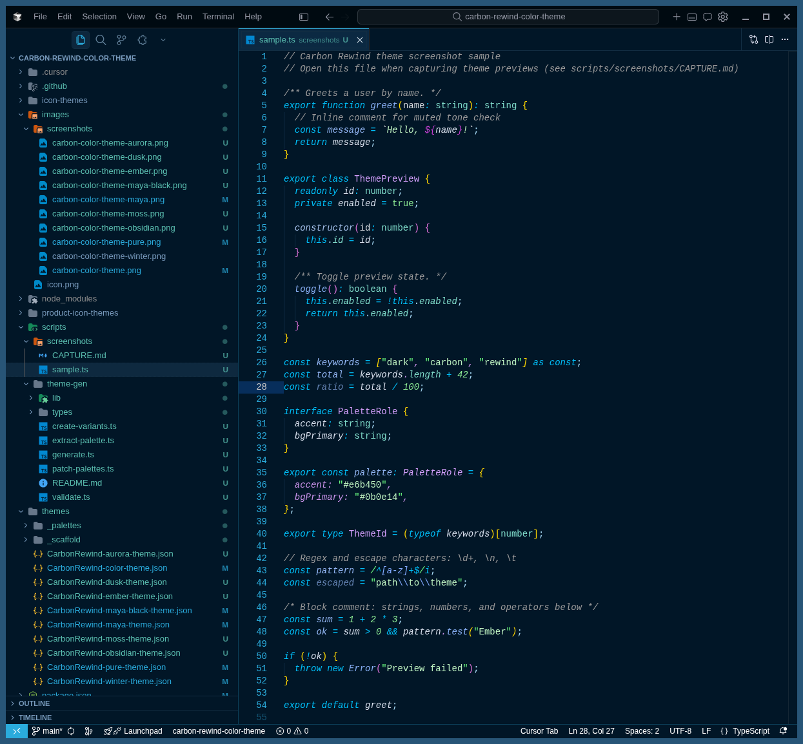
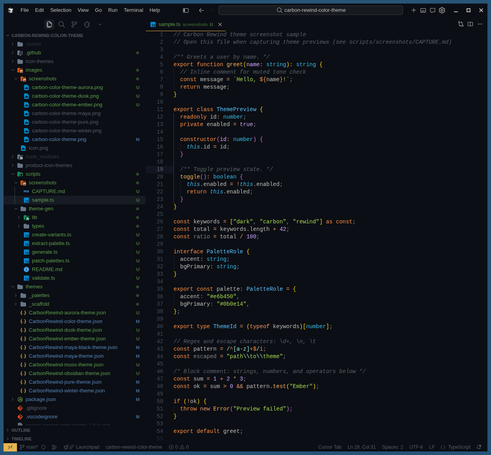
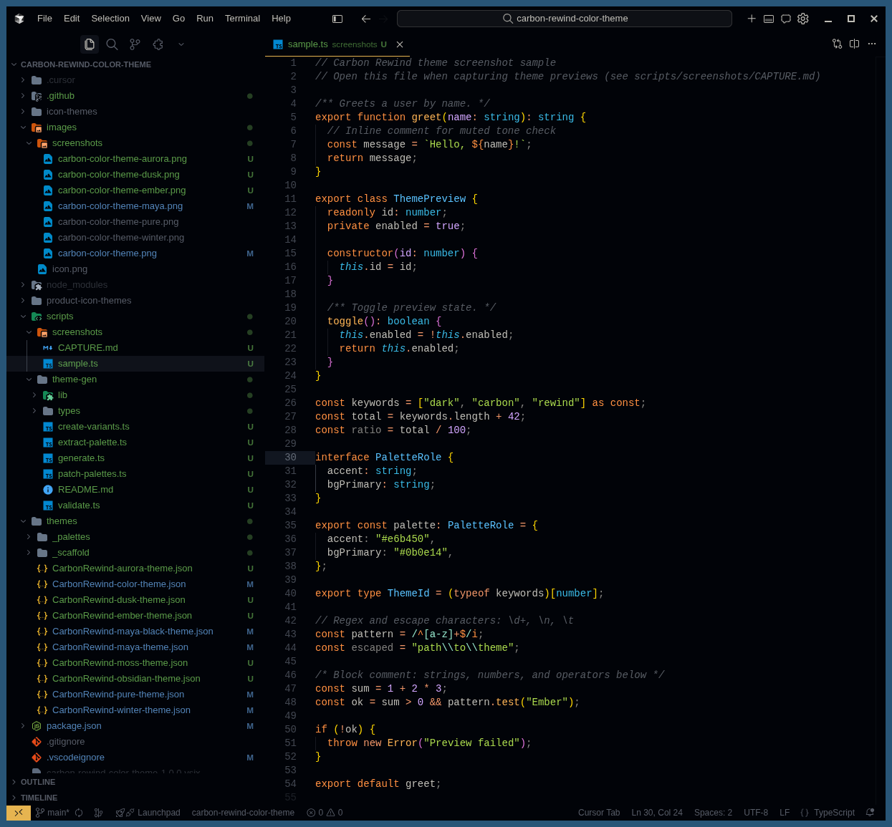
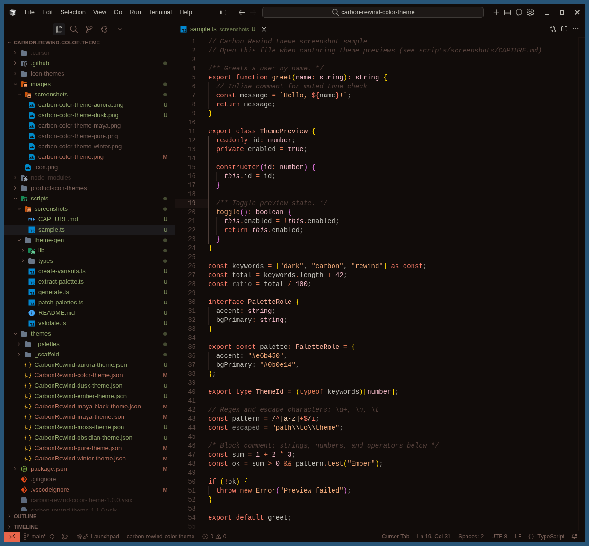
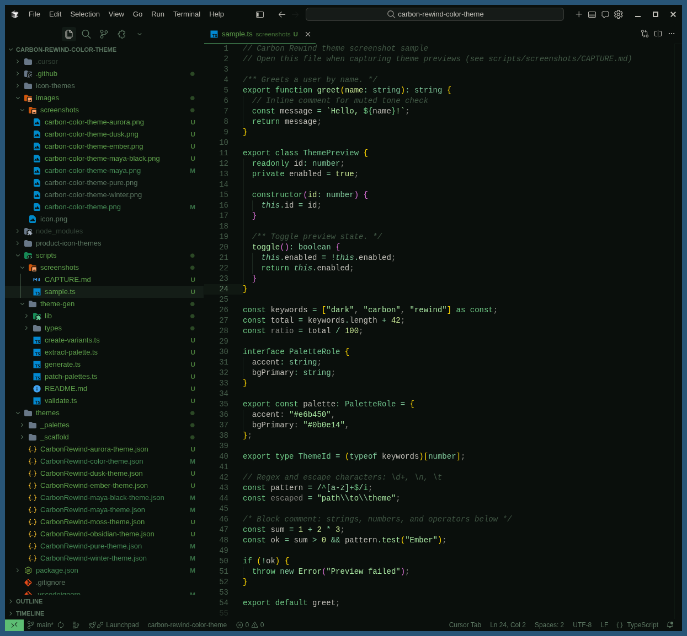
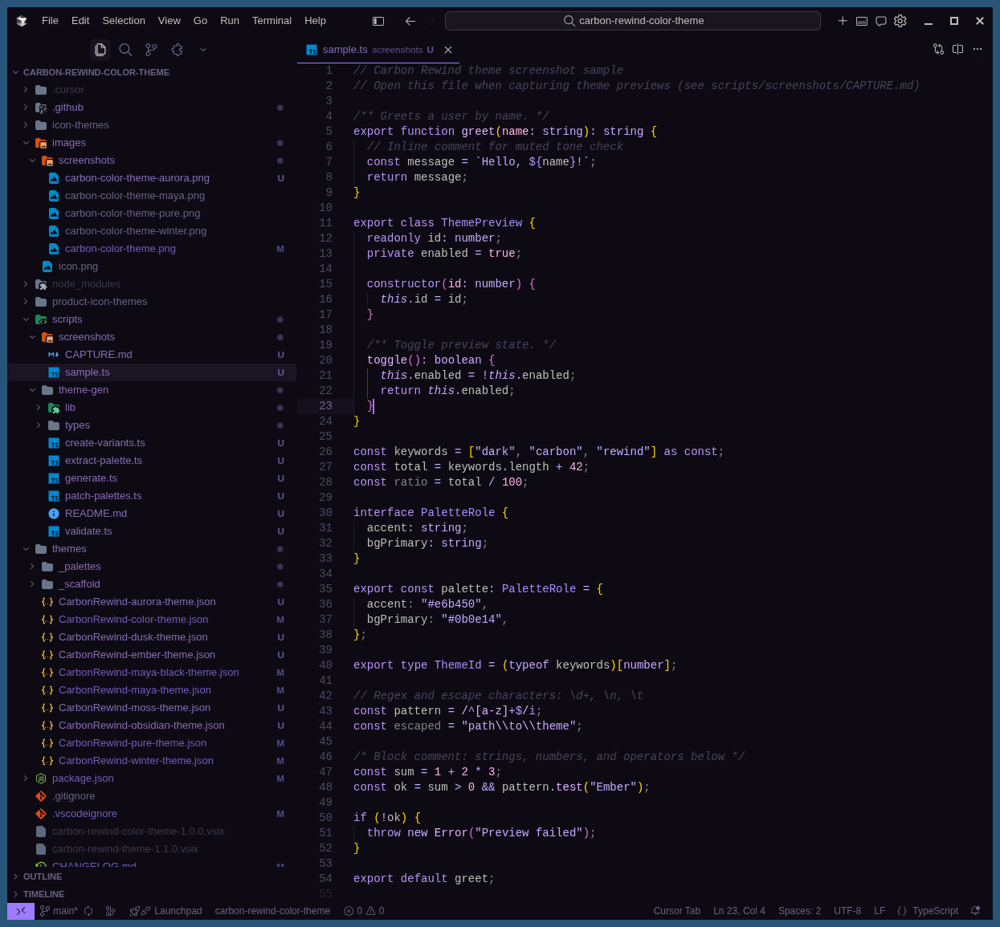
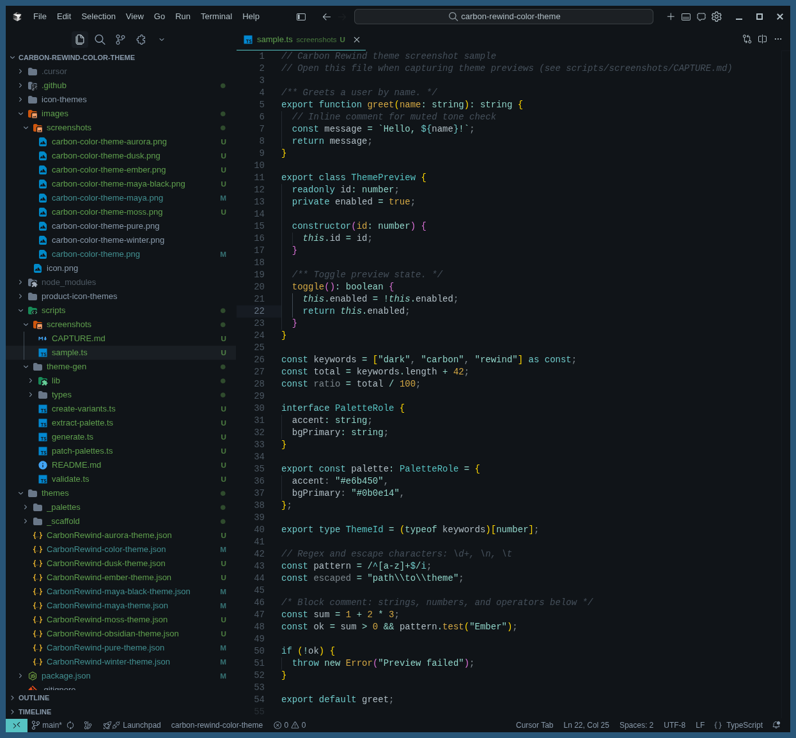
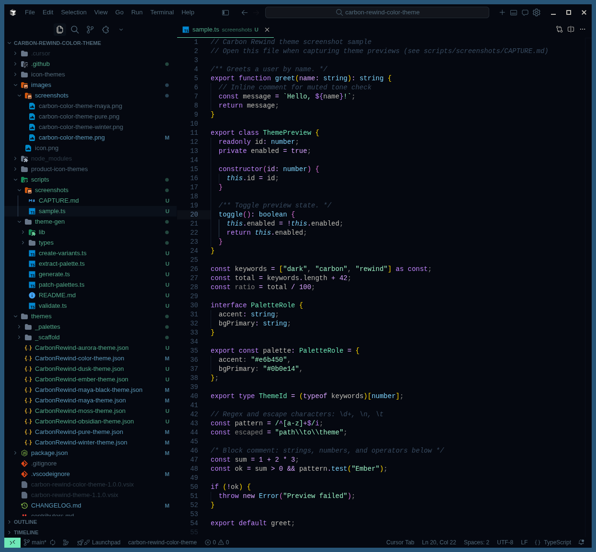

# [Carbon Rewind Color Theme](https://github.com/darkmusic/carbon-rewind-color-theme)

[](https://marketplace.visualstudio.com/items?itemName=darkmusic.carbon-rewind-theme)
[](https://marketplace.visualstudio.com/items?itemName=darkmusic.carbon-rewind-theme)
[](https://open-vsx.org/extension/darkmusic/carbon-rewind-theme)

A family of dark color themes with matching file and product icons for Visual Studio Code and VS Code–compatible editors (Cursor, VSCodium, Gitpod, and others), available on the Visual Studio Marketplace and Open VSX.

## Installation

Press `Ctrl/Command + Shift + P` to launch the command palette, then run:
```
ext install darkmusic.carbon-rewind-theme
```

## What's New

1. Carbon Rewind Color Theme - Aurora
2. Carbon Rewind Color Theme - Obsidian
3. Carbon Rewind Color Theme - Dusk
4. Carbon Rewind Color Theme - Moss
5. Carbon Rewind Color Theme - Ember
6. TypeScript theme generation toolchain — see [`scripts/theme-gen/README.md`](scripts/theme-gen/README.md)

## Default font: FiraCode Nerd Font

Carbon Rewind sets **FiraCode Nerd Font** as the default editor and terminal font when the extension is installed. To install the font locally:

1. Download [FiraCode Nerd Font (latest release)](https://github.com/ryanoasis/nerd-fonts/releases/latest/download/FiraCode.zip), extract the archive, and install the font files for your system.
2. Reload your editor if the font does not appear immediately. The extension applies these defaults:

   ```json
   "editor.fontFamily": "FiraCode Nerd Font, Consolas, 'Courier New', monospace",
   "terminal.integrated.fontFamily": "FiraCode Nerd Font, Consolas, 'Courier New', monospace",
   "editor.fontLigatures": true,
   "editor.fontSize": 12.4,
   "editor.letterSpacing": 0.2,
   "editor.lineHeight": 1.5,
   "terminal.integrated.fontSize": 12,
   "scm.showHistoryGraph": false
   ```

## Alternative: Hack Nerd Font

To use Hack Nerd Font instead:

1. Download [Hack Nerd Font (latest release)](https://github.com/ryanoasis/nerd-fonts/releases/latest/download/Hack.zip), extract the archive, and install the font files for your system.
2. In your settings, add the following configuration:

   ```json
   "editor.fontFamily": "Hack Nerd Font, Menlo, Monaco, 'Courier New', monospace",
   "terminal.integrated.fontFamily": "Hack Nerd Font, Menlo, Monaco, 'Courier New', monospace",
   "editor.fontLigatures": true,
   "editor.fontSize": 12.4,
   "editor.letterSpacing": 0.4,
   "editor.lineHeight": 1.5,
   "terminal.integrated.fontSize": 12,
   "scm.showHistoryGraph": false
   ```

## Alternative: ComicShannsMono Nerd Font

To use ComicShannsMono Nerd Font instead:

1. Download [ComicShannsMono Nerd Font (latest release)](https://github.com/ryanoasis/nerd-fonts/releases/latest/download/ComicShannsMono.zip), extract the archive, and install the font files for your system.
2. In your settings, add the following configuration:

   ```json
   "editor.fontFamily": "ComicShannsMono Nerd Font, Menlo, Monaco, 'Courier New', monospace",
   "terminal.integrated.fontFamily": "ComicShannsMono Nerd Font, Menlo, Monaco, 'Courier New', monospace",
   "editor.fontLigatures": true,
   "editor.fontSize": 13.4,
   "editor.letterSpacing": 0.4,
   "editor.lineHeight": 1.4,
   "terminal.integrated.fontSize": 12.5,
   "scm.showHistoryGraph": false
   ```

## Screenshots

Capture instructions: [`scripts/screenshots/CAPTURE.md`](scripts/screenshots/CAPTURE.md)

**Carbon Rewind Color Theme**


**Carbon Rewind Color Theme - Pure**


**Carbon Rewind Color Theme - Winter**


**Carbon Rewind Color Theme - Maya**


**Carbon Rewind Color Theme - Maya Black**


**Carbon Rewind Color Theme - Ember**


**Carbon Rewind Color Theme - Moss**


**Carbon Rewind Color Theme - Dusk**


**Carbon Rewind Color Theme - Obsidian**


**Carbon Rewind Color Theme - Aurora**


## Todo List

See [GitHub Projects](https://github.com/darkmusic/carbon-rewind-color-theme) for more details.

## Requirements

* [Visual Studio Code](http://code.visualstudio.com/)

## License

This project is licensed under the MIT License. For more details, please see the [LICENSE](LICENSE) file.

## Contributing

Contributions are welcome! Bug fixes, new features, and extra modules are encouraged.

* To contribute code: Fork the repo, push your changes to your fork, and submit a pull request.

For more information, see [contributors.md](contributors.md).
